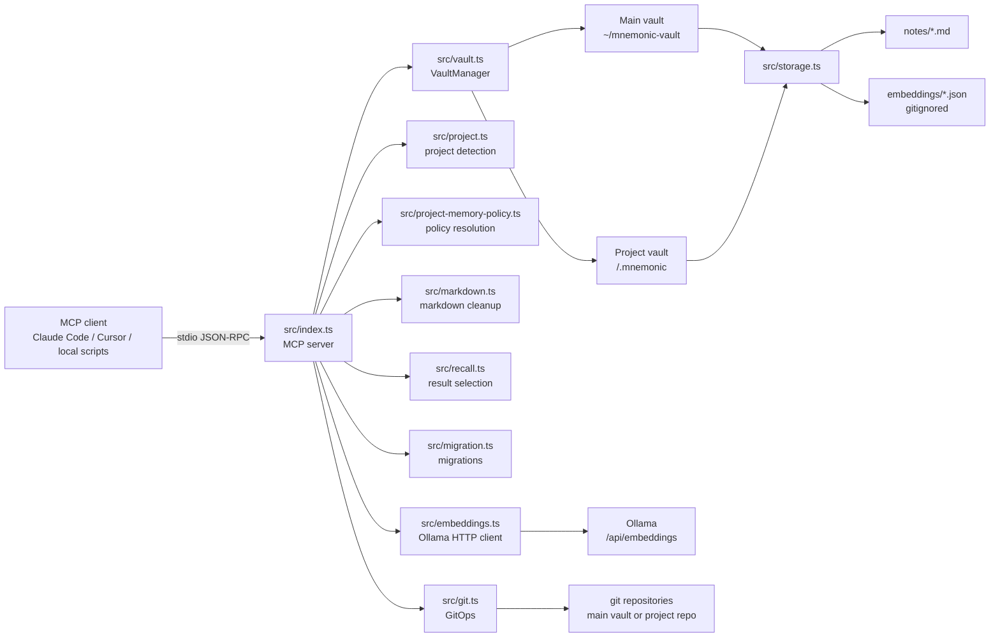
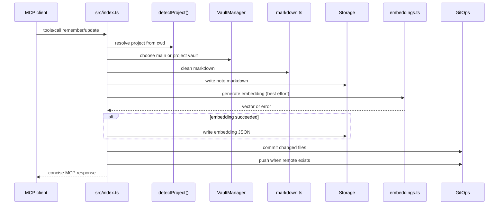

# Architecture

`mnemonic` is a file-first MCP memory server. It stores notes as markdown, keeps embeddings as local JSON, routes reads and writes across a main vault and optional project vaults, and uses git as the synchronization and audit layer instead of a database.

## System goals

- Keep memory durable, inspectable, and portable by storing source data as normal files.
- Make project context first-class without losing access to global memory.
- Let MCP clients spawn the server on demand over stdio instead of depending on an always-on service.
- Treat embeddings as derived data that can be rebuilt locally.
- Keep the architecture simple enough to evolve through notes, tests, and migrations rather than heavyweight infrastructure.

## Core concepts

### Vaults

- **Main vault**: private global memory, usually `~/mnemonic-vault`, with its own git repo.
- **Project vault**: shared project memory in `<git-root>/.mnemonic/`, committed inside the project repo.
- Both vault types use the same file format and `Storage` implementation.

### Notes and embeddings

- Notes live in `notes/<id>.md` with YAML frontmatter and markdown body.
- Embeddings live in `embeddings/<id>.json` and are gitignored.
- A note can be global or project-associated, and can hold typed relationships to other notes.

### Project identity

- Project identity comes from the git remote URL when available.
- This produces a stable slug that survives different local clone paths across machines.
- If no remote exists, mnemonic falls back to the git root folder, then finally the directory name.

### MCP-first operations

- `src/index.ts` registers the MCP tools and is the orchestration layer.
- Most user-visible behavior is exposed through tools like `remember`, `recall`, `update`, `forget`, `sync`, `consolidate`, and migration commands.
- The local helper `scripts/mcp-local.sh` rebuilds and launches the current server for dogfooding and CI-safe integration tests.

## Runtime topology



## Main request flows

### Write flow

For commands like `remember` and `update`, the server resolves project context, chooses the target vault, writes the note, attempts to refresh embeddings, and then commits/pushes the changed files when git is enabled.



### Recall flow

Recall searches embeddings from the project vault first when `cwd` is present, then widens to the main vault. Project matches receive a score boost, and the lightweight heuristic in `src/recall.ts` prefers current-project hits before filling remaining slots with global matches.

```mermaid
flowchart TD
    Query[recall query] --> Embed[Embed query text]
    Embed --> Search[VaultManager.searchOrder(cwd)]
    Search --> ProjectEmbeddings[Project vault embeddings]
    Search --> MainEmbeddings[Main vault embeddings]
    ProjectEmbeddings --> Score[cosine similarity + project boost]
    MainEmbeddings --> Score
    Score --> Filter[scope / tags / minSimilarity]
    Filter --> Select[src/recall.ts\nselectRecallResults]
    Select --> Format[format notes for MCP output]
```

### Sync and migration flow

- `GitOps.sync()` performs `fetch -> count unpushed commits -> pull --rebase -> diff note changes -> push` and returns note ids that need re-embedding.
- `Migrator` applies schema-aware note migrations across loaded vaults and updates `config.json` schema version only after successful non-dry-run global execution.

## Source layout and responsibilities

| Path | Responsibility |
| --- | --- |
| `src/index.ts` | MCP server entry point, tool registration, orchestration, CLI migration command |
| `src/storage.ts` | Markdown note persistence, embedding JSON persistence, core types |
| `src/vault.ts` | Main/project vault lifecycle, search order, vault routing |
| `src/project.ts` | Stable project detection from git metadata |
| `src/project-memory-policy.ts` | Write-scope and consolidation policy rules |
| `src/embeddings.ts` | Ollama HTTP client and cosine similarity |
| `src/git.ts` | Git initialization, commit, push, sync, and diff helpers |
| `src/markdown.ts` | Markdown linting and normalization before persistence |
| `src/migration.ts` | Schema migration registry and execution |
| `src/consolidate.ts` | Consolidation helper logic for merge plans and relationship cleanup |
| `src/recall.ts` | Recall result selection heuristic |
| `src/config.ts` | Main-vault runtime config and per-project policy storage |
| `tests/` | Vitest unit and integration coverage, including MCP smoke tests |

## Data model

### Note

- `id`: stable slug + suffix used as the filename stem.
- `title`, `content`, `tags`: user-facing memory content.
- `project`, `projectName`: project association without forcing storage into the project vault.
- `relatedTo`: typed edges (`related-to`, `explains`, `example-of`, `supersedes`).
- `createdAt`, `updatedAt`: ISO timestamps.
- `memoryVersion`: note schema version for migration compatibility.

### Config

Main-vault `config.json` stores machine-local operational settings rather than memory content.

- `schemaVersion`: current vault schema.
- `reindexEmbedConcurrency`: bounded concurrency for rebuilding embeddings.
- `projectMemoryPolicies`: saved per-project defaults for write scope and consolidation mode.

## Important architectural rules

- **One note per file**: keeps git conflicts isolated and manual inspection simple.
- **Embeddings are derived**: never treat them as source-of-truth or something that must be committed.
- **Project context and storage are separate**: a note can belong to a project while living in the main vault.
- **Git is part of the product behavior**: most mutating operations commit and push, so error handling must treat git failures as real failures.
- **Project recall is biased, not exclusive**: project memory should be preferred without making global memory disappear.
- **Migrations are explicit**: schema changes should go through `src/migration.ts`, tests, and dry-run-first workflows.

## Operational and testing conventions

- Local dogfooding should use `scripts/mcp-local.sh` so the built server matches the current source tree.
- CI-safe MCP integration tests use the real local entrypoint with `DISABLE_GIT=true`, a temp `VAULT_PATH`, and a fake `OLLAMA_URL` endpoint.
- CI failure learnings are artifact-first and promoted manually into memory through MCP rather than auto-written on every failed run.

## Future pressure points

- Recall latency as memory volume grows.
- More sophisticated clustering or consolidation strategies.
- Richer cross-vault relationship navigation.
- Smarter reindexing and sync behavior for large repositories.

The current architecture intentionally favors simple, inspectable behavior over aggressive runtime optimization. When trade-offs appear, prefer preserving file-first correctness and MCP ergonomics before adding heavier caching or service layers.
